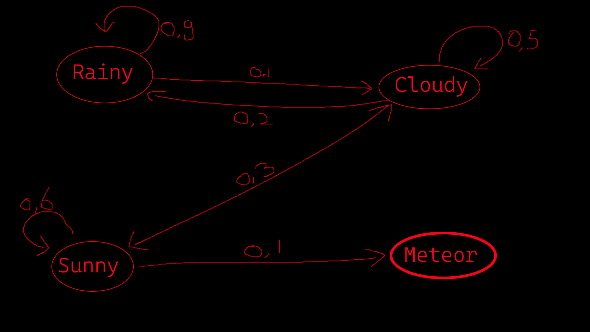
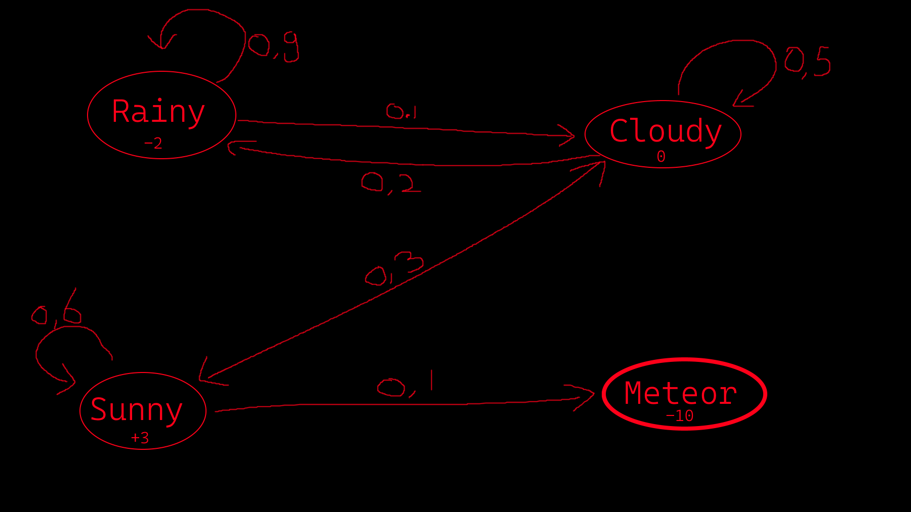
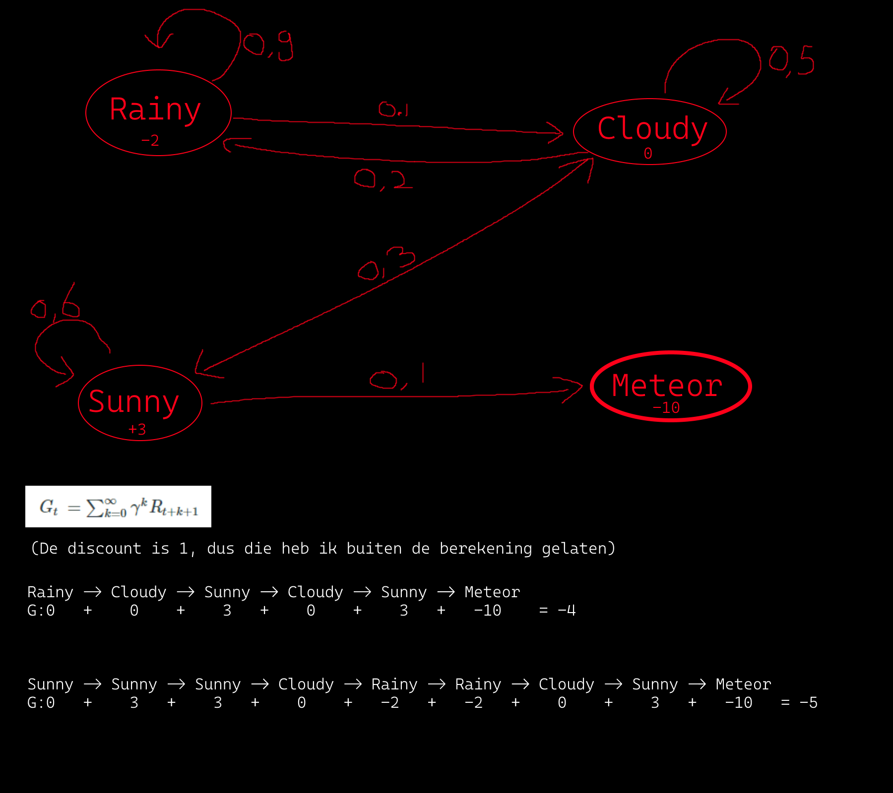
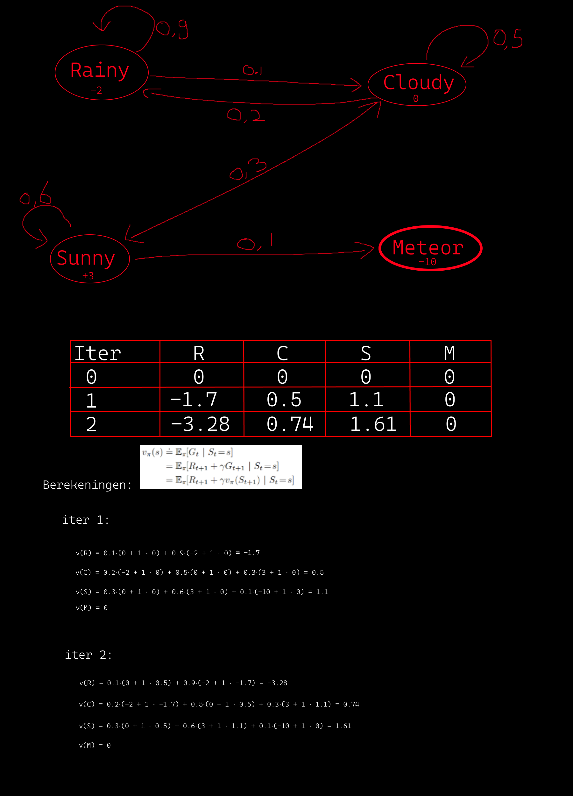

# Adaptive Systems / Inleveropgave 1
In deze directory zullen alle opdrachten van de eerste inleveropgave zitten, ook de theoretische opdrachten.

## Theoretische opdrachten:
### 1.1 Markov Chain:
Created states and policies.

### 1.2 Markov Reward Process:
Added rewards.

### 1.3 Sampling. Een voorbereiding voor Monte-Carlo Policy Evaluation:
Added samples.

### 1.4 De value-function bepalen:

### 1.5 Zelf-onderzoek
 In werkelijkheid zien we vrijwel nooit een discount factor van 1. Een discount factor van 0.9 is wel veel voorkomend. Noem twee problemen die je mogelijk hebt met γ=1

##### Probleem 1:
Een discount rate van 1 zorgt ervoor dat de rewards in de toekomst evenveel meetellen als een reward die een agent gelijk krijgt.

"A reward received k time steps in the future is worth only γk-1 times what it would be worth if it were
received immediately." 
(Page 55, Sutton, R. S., & Barto, A. G. (2018). Reinforcement Learning, second edition. Amsterdam University Press.)

##### Probleem 2:
Een discount rate dat kleiner is dan 1 is een wiskundig trucje om een oneindige som eindig te maken.
Dit helpt met het convergeren van het algoritme als het niet zeker is wanneer het programma eindigt.